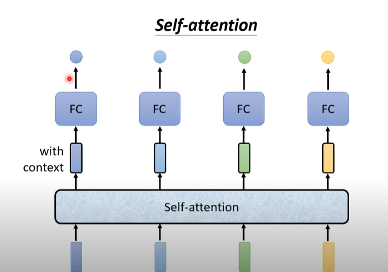
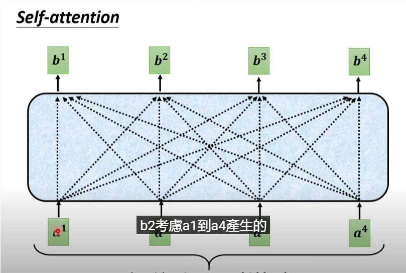
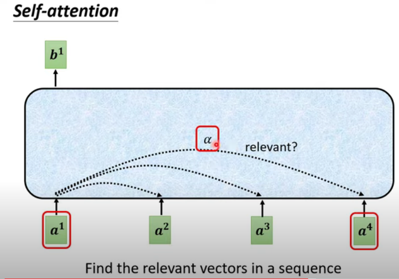
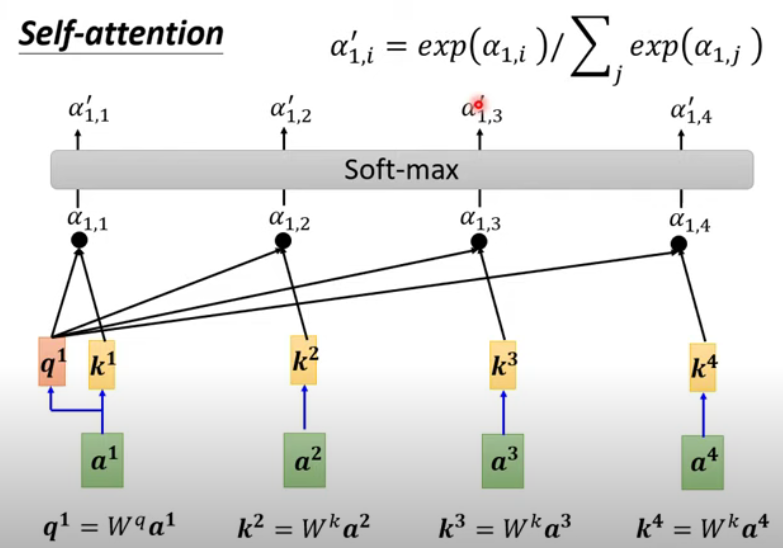
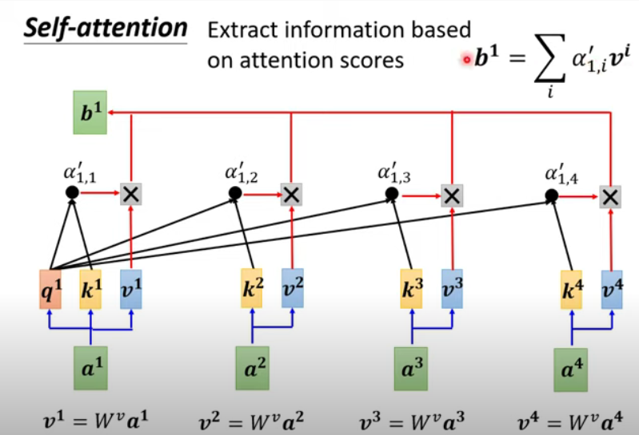
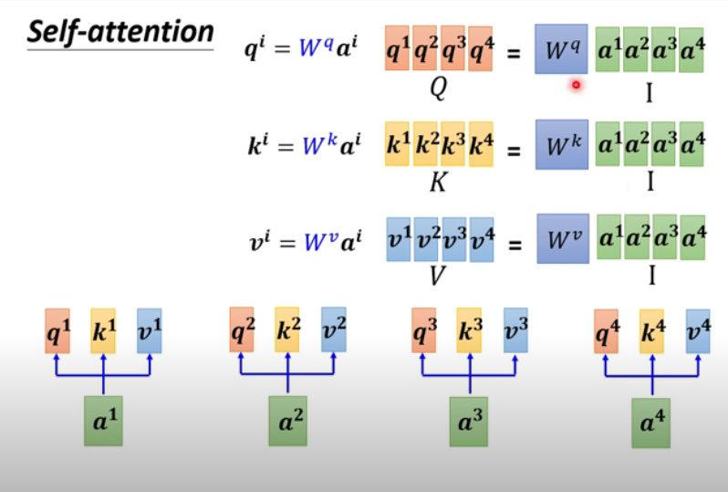
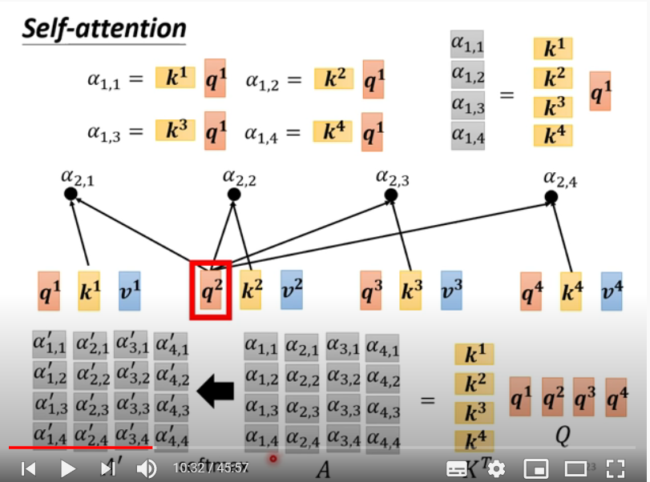
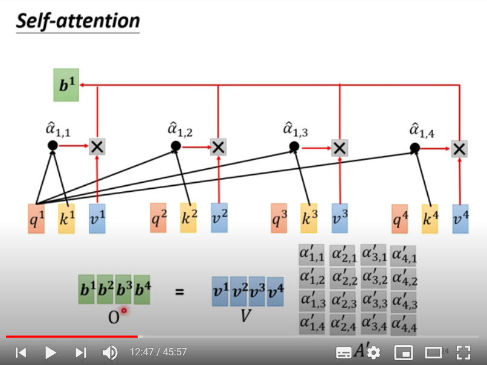
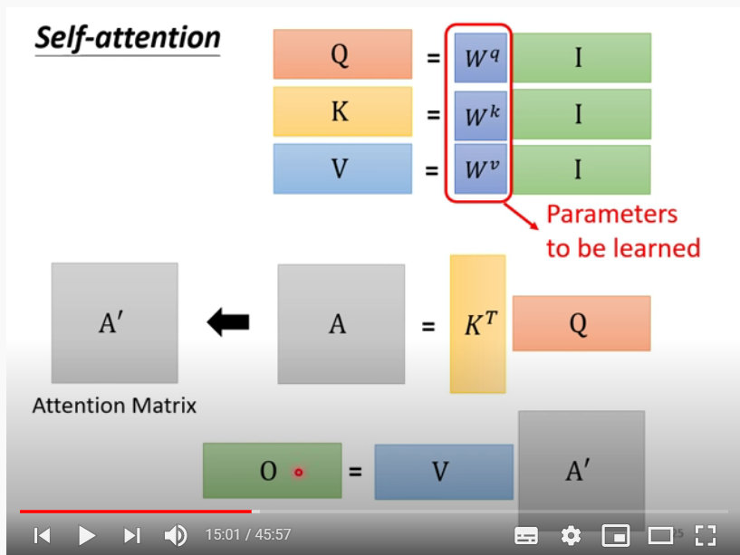

> 学习了李宏毅老师的机器学习2021课程，讲的很清晰，值得记录一下。原视频：https://www.youtube.com/watch?v=hYdO9CscNes。

### 为什么要用Self-Attention

以序列标注任务（Sequence Labeling）为例。为了更好的理解某个单词的词性，我们需要**尽可能多的考虑到整句话的内容**。例如下面这句话：

> I saw a saw

我们要考虑整句话的内容，才能判断出第一个 *saw* 和第二个*saw*的词性。

产生一个问题：我们是否有一种方法，它可以考虑到整个句子的所有的词。

### Self-Attention怎么运作的



在图中，最下面是input的四个单词向量，通过了Self-attention后，会输出带有上下文信息的单词向量（with context）。然后再通过一个全连接层（Fully Connect）。值得注意的是，我们可以重复这样的一个过程，通过叠加自注意层和FC层。其中比较著名的例子就是The Transformer。

在这个图中，可以看到input是 $a^1,...,a^4$，output是$b^1,...,b^4$。

我们以$b^1$为例，从虚线可以看出，向量$b^1$的产生考虑到了$a^1,...,a^4$四个输入的信息，因此我们可以认为$b^1$是包含了上下文的信息。同理$b^2,...,b^4$也是考虑了所有的输入向量。

**如何考虑与其他词的关系呢**

我们需要去判断两个词的相关性，其相关程度我们以$\alpha$ 来表示，也可以成它为分数。

关于$\alpha$的计算有很多种方法，我们可以将计算$\alpha$的方法称为**分数函数**。其中**dot-product** 方法最常用，我们以它为例。

已知，input向量分别是$a^1,...,a^4$ 

- 让他们乘上一个矩阵$W^q$，得到了query向量$q^1,...,q^4$。

- 同理分别乘上一个矩阵$W^k$，得到了key向量$k^1,...,k^4$。

我们让$q^1$ 和$k^2$ 相乘，得到一个标量$a_{1,2}$，表示$a_1$对$a_2$的注意程度。同理我们分别让$q^1$与$k^3,k^4,k^1$相乘，可以计算出$a_{1,3} ,a_{1,4},a_{1,1}$ 。

为了让数据更加规范，我们通过Softmax函数进行归一化处理，得到$a_{1,1}^{\prime} ,...,a_{1,4}^\prime$。

- 然后我们让$a^1,...,a^4$ 乘上矩阵$W^v$就可以得到value向量$v^1,...,v^4$。

- 最后通过加权求和，我们就得到$a^1$对应的output向量$b^1$。

其中output向量$b^1$，它具有上下问信息，因为它是通过“**注意**”其他词并且加权求和得到的向量。

同理，我们可以通过上面的方法，分别求出$a^2,a^3,a^4$对应的输出$b^2,b^3,b^4$。

### 用矩阵乘法的角度

与RNNs不同的是，自注意力机制可以通过矩阵的乘法来实现并行运算，而RNNs需要依赖前一个时间步长的输出。下面就是介绍用矩阵来计算。

 对于每一个向量$a^1,...,a^4$，我们分别计算他们的$q^i,k^i,v^i,i\in{1,..,4}$ 。

以向量$q^i$为例，我们将$W^q$乘上$a^1$得到$q^1$，乘上$a^2$得到$q^2$，以此类推。

其实我们可以将$a^1,...,a^4$ 拼成一个矩阵$I$ ，让$W^q$ 乘上$I$ 就得到矩阵$Q$。其中$Q = \{q^1,q^2,q^3,q^4\}$。同理也可以得到矩阵$K$ 和$V$。

**计算注意力分数**

我们用$\alpha_{i,j}$ 表示$a^i$ 注意$a^j$的分数。

我们让$k^1,...,k^4$ 竖着拼成一个矩阵$K^T$，再乘上$q^1$ 就可以得到$\alpha_{1,1},...,\alpha_{1,4}$，同理乘上$q^2,q^3,q^4$。

用矩阵表示就是$A = K^T Q$

我们可以得到注意力分数矩阵$A$ ，然后通过Softmax得到所有的归一化的分数矩阵$A\prime。$

**加权求和得到输出向量**

再这里也是一样，我们让$v^1$ 乘上分数矩阵$A\prime$ 就可以得到$b^1$，同理可以得到$b^2,...,b^4$。

用矩阵表示就是$O = V A\prime$

整体流程如上，其中$W^q,W^k,W^v$ 是需要模型学习的参数，其他都是固定的。

