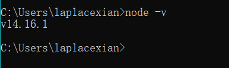
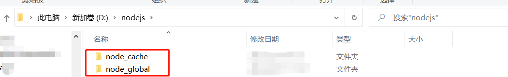
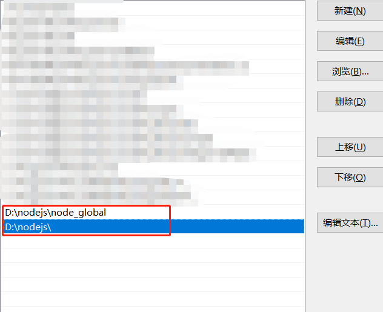

参考：https://www.jianshu.com/p/13f45e24b1de

## 安装Node.js 、 npm、yarn

1.下载node.js，自带了npm，下载地址：https://nodejs.org/en/download/

2.安装，一直next。记住你**安装的路径**，我的是D:\nodejs

3.验证是否安装成功

 win + r ，打开 cmd。 

- 测试node -v

  

- 测试npm -v

- 测试npm install express -g ，安装express包，-g 表示全局

4.更改库的安装路径

​	找到你nodejs的安装路径，例如D:\nodejs。

1. 新建两个文件夹，分别是**node_cache**、**node_global**。

   ​	node_cache文件夹为nodejs的缓存目录

   ​	node_global文件夹为nodejs的全局目录

2. 设置npm的安装路径

   记住**你的安装路径**，我的是D:\nodejs	

   打开cmd或者 windows powershell，输入

   `npm config set prefix "D:\nodejs\node_global"`

   ` npm config set cache "D:\nodejs\node_cache"`

   

   

3. 再次安装express，验证安装到指定目录。

   用**管理员**身份打开，或者win + x ，打开windows powershell (管理员)

   输入`npm install express -g`

   可以看到，安装了express包到了指定文件夹中

   

   

   

4. 添加环境变量

   win + r ，输入`sysdm.cpl`

   选择，高级，环境变量

   

选择系统变量的Path，编辑

新建，输入路径D:\nodejs\node_global，保存并退出

验证，win + x，选择 powershell 管理员。

安装yarn: ` npm install yarn -g`

验证：`yarn --version`

## 用visual studio code 打开项目文件夹

 打开终端，输入`yarn`，安装依赖

安装完成后，输入`yarn start`

等待打包，运行程序。

进入Local 网页

安装插件：

HTML snippets

JavaScript (ES6) code snippets

CSS Peek

Path autocomplete

Reactjs code snippets

ESLint

